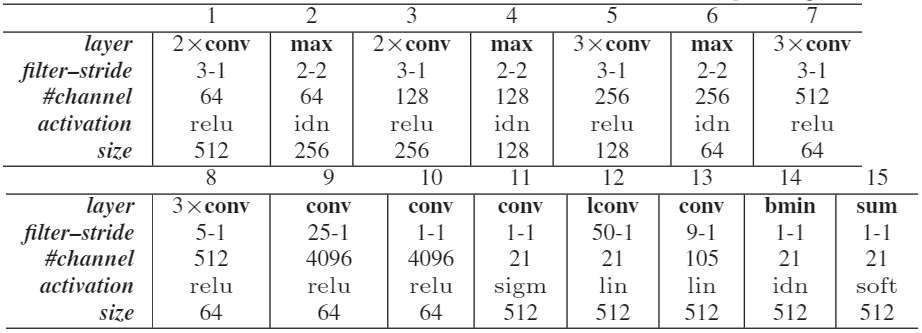
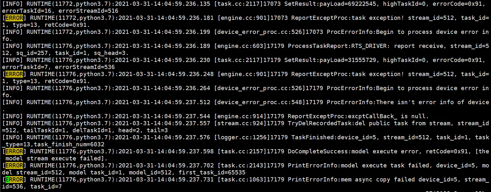
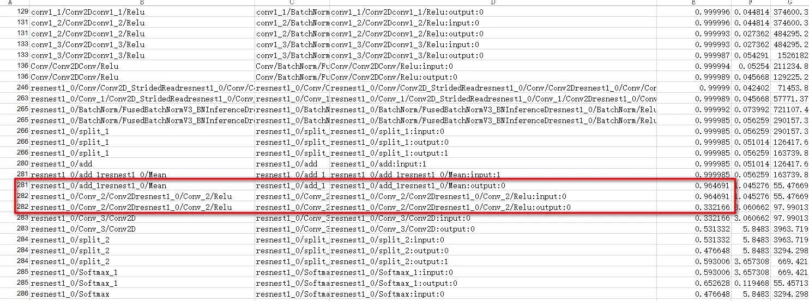
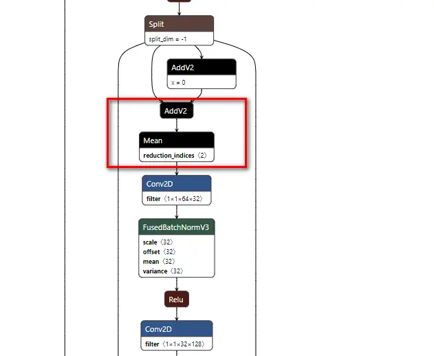

# 【计算机视觉CV，tensorflow】关于DPN和ResNext分割网络训练调优的一点心得


## 1. 背景 

昇腾910 AI处理器是华为在2019年发布的人工智能（AI）专用的神经网络处理器，其算力高达256T，最新款算力高达310T，是业界主流芯片算力的2倍，可配套MindSpore训练框架。当前业界大多数训练脚本基于TensorFlow的Python API开发，默认运行在CPU/GPU/TPU上。为了使其能够利用昇腾910 AI处理器的澎湃算力执行训练，提升训练性能，我们需要对训练网络脚本进行相关的迁移适配工作。

## 2. DPN的坑  

### 卷积核太大,无法完成初始化 

DPN(Deep Parse Network) 是一种用于语义分割的模型，将一元项和成对项的推理和学习统一到一个卷积网络中。DPN的主要工作是将高阶马尔可夫随机场(MRF)的平均场推断为公式化的CNN，同时将高阶关系和标签上下文的混合应用到其成对术语建模中。 模型结构如下图所示。   

  

DPN的前11层沿用VGG-16的基础模型结构，到第11层时特征图已经只有原图1/8的大小，作者在11层后面加了一个上采样层保证输出尺寸与原图一致。而后12至15层表示它通过局部卷积层和块最小池化层实现了马尔可夫随机场（MRF）的近似过程，并通过实验证实DPN能通过一次迭代达到较好的近似效果。最后将11层的输出和14层的输出进行拼接相加，通过sigmoid函数激活后得到最后的输出。  

原始论文中设计的网络结构需要占用非常大的内存空间，主要是第8层卷积（`5*5*512`）、第9层卷积（`25*25*4096`），第12层局部卷积（`50*50*21`）和第13层卷积（`9*9*105`），在双精度下，这几个卷积层占了总内存的90%以上。鉴于NPU上可用的内存只26G左右，而NPU暂时无法支持模型的分布式计算。为了在单个NPU上能够正常训练，对这几个卷积层进行了适当的修改，达到参数降维的目的。

> 目前平台的硬件在训练场景有32G内存，默认给变量预留5G，给算子运行需要的内存预留26G。 

### 动态shape 坑 

普通卷积中卷积核在各个sliding window上共享，在channel上不共享。但DPN为了模拟阶马尔可夫随机场所设计的卷积要求在sliding window上不共享，而在channel上共享。  
具体实现如下：  
```py
def local_conv2d(inputs, kernel, kernel_size, strides, output_shape):
    # input: (batch_size, input_row, input_col, input_filter)
    # kernel: (output_row * output_col, kernel_row * kernel_col * input_filter, output_filters)
    # kernel_size: (kernel_row, kernel_col)
    # strides: (stride_row, stride_col)
    # output_shape: (output_row, output_col)
    # data_format=None: 'channels_first' or 'channels_last'
    data_format = 'channels_last'
    stride_row, stride_col = strides
    output_row, output_col = output_shape
    kernel_shape = kernel.shape
    _, dim, filters = kernel_shape
    kernel_row, kernel_col = kernel_size[0], kernel_size[1]
    inputs = tf.reduce_sum(inputs, axis=-1, keep_dims=True)
    # result: (batch_size, output_row * output_col, kernel_row * kernel_col * input_filter)
    image_patches = tf.extract_image_patches(inputs,
                                             [1, kernel_row, kernel_col, 1],
                                             [1, stride_row, stride_col, 1],
                                             [1, 1, 1, 1],
                                             padding='SAME')

    image_patches = tf.reshape(image_patches, [-1, output_row * output_col, dim])
    image_patches = tf.transpose(image_patches, [1, 0, 2])
    output = tf.matmul(image_patches, kernel)
    output = tf.reshape(output,
                        (output_row, output_col, -1, filters))

    if data_format == 'channels_first':
        output = tf.transpose(output, (2, 3, 0, 1))
    else:
        output = tf.transpose(output, (2, 0, 1, 3))
    return nn.lin(output)
```
这里面涉及到了多次动态shape变换,迁移到npu平台时出现`GeOp5_0GEOP`下沉失败问题.出现问题后我们及时进行了分析, 经过日志定位发现是`SparseTensorDenseMatMul`算子InferShape阶段报错. 我们通过制作镜像，替换`libopsproto.so`，并修改`ir2tf_op_mapping_lib.json`中`SparseTensorDenseMatMul`配置信息解决了该问题。不过后续官方很快就推出了新的镜像,泪目(官方更新速度yyds). 详细的讨论见issue。  
https://gitee.com/ascend/modelzoo/issues/I38MUD  


### 推理坑 

需要用到最新的软件栈。在使用`atc`工具转换模型时，遇到如下的报错。 
```sh
ATC start working now, please wait for a moment.
Traceback (most recent call last):
  File "/home/HwHiAiUser/Ascend/ascend-toolkit/latest/atc/python/site-packages/te/platform/fusion_manager.py", line 706, in call_op_func
    return opfunc(*inputs, *outputs, *attrs)
  File "/home/HwHiAiUser/Ascend/ascend-toolkit/latest/opp/op_impl/built-in/ai_core/tbe/impl/pad_d.py", line 2176, in op_select_format
    unknownshape_format=format_str)
TypeError: gen_param() got an unexpected keyword argument 'unknownshape_format'
Traceback (most recent call last):
  File "/home/HwHiAiUser/Ascend/ascend-toolkit/latest/atc/python/site-packages/te/platform/fusion_manager.py", line 706, in call_op_func
    return opfunc(*inputs, *outputs, *attrs)
  File "/home/HwHiAiUser/Ascend/ascend-toolkit/latest/opp/op_impl/built-in/ai_core/tbe/impl/pad_d.py", line 2176, in op_select_format
    unknownshape_format=format_str)
TypeError: gen_param() got an unexpected keyword argument 'unknownshape_format'
ATC run failed, Please check the detail log, Try 'atc --help' for more information
E19000: Path[/home/HwHiAiUser/Ascend/ascend-toolkit/20.1.rc1/x86_64-linux/opp/op_impl/custom/ai_core/tbe/config/ascend310]'s realpath is empty, errmsg[The file path does not exist.]
E40006: Get op[upsample/Pad]'s format failed, reason: Failed to call op func [op_select_format], needto check op info: module name[impl.pad_d],op name [op_select_format].
E40006: Get op[upsample/Pad]'s format failed, reason: Failed to call op func [op_select_format], needto check op info: module name[impl.pad_d],op name [op_select_format].
E13002: Op type[PadD] of ops kernel[AIcoreEngine] is unsupported, Op upsample/Pad not supported reason: The type of this op is not found in op store, check whether the op store has this type of op. Op store name is tbe-plugin.

E13003: Can't find any supported ops kernel and engine of [upsample/Pad], type is [PadD]
E13003: Can't find any supported ops kernel and engine of [upsample/Pad], type is [PadD]
```
提交issue后很快得到了回复(给官方的速度点赞)。问题是`CANN 20.1rc1`版本对`pad`支持不够，而当时最新版`20.2`已经添加了对该算子的支持。更新相关的环境即可实现正常的模型转换和推理。需要注意的是，一旦更新了某一部分就要关注其依赖是否也需要更新。例如`CANN`包时需要同步更新驱动，以及`msame`推理工具。 详细的讨论在issue中。 
https://gitee.com/ascend/modelzoo/issues/I3EJKX?from=project-issue   
https://gitee.com/ascend/modelzoo/issues/I39AX5?from=project-issue  


## 2. ResNeXt 坑 

### 数据并行的分布式训练 
我们复现的是`ResNeXt+DeeplabV3`做分割的模型。原论文使用8机64卡分布式训练，经过协商，我们最终决定采用单机8卡分布式训练(感谢官方直接提供了一台8卡裸机给我们）。npu上进行分布式训练与gpu上存在较大差异。我们依据官方教程，并根据自己的实践总结了一个Wiki文档，链接如下。   
https://gitee.com/ascend/modelzoo/wikis/%E5%9F%BA%E4%BA%8Enpu%E5%8D%95%E6%9C%BA8%E5%8D%A1docker%E7%8E%AF%E5%A2%83%E7%9A%84%E8%AE%A1%E7%AE%97%E5%88%86%E5%B8%83%E5%BC%8F%E8%AE%AD%E7%BB%83%E6%8B%89%E8%B5%B7?sort_id=3511579   

### AvgPool报错和reduce 操作上溢

在gpu端完成分布式训练后，我们迁移到npu上发现执行失败。为了找到具体问题，我们设置`export ASCEND_SLOG_PRINT_TO_STDOUT=1`，可以看到tf背后底层算子的执行情况(在代码里面可以写成`os.environ['ASCEND_SLOG_PRINT_TO_STDOUT'] = '1'`)，我们发现`AvgPool2D`算子报错。修改相关的配置文件解决了该问题，但是后续又报出`ReportExceptProc:task exception! `错误。   
  

这是内存拷贝错误，分析device日志，发现是`reduce`操作上溢。但是此问题在`4.17`后的`CANN`软件包已经解决了。我们更新了相关的软件栈，成功跑通。相关issue如下。  
https://gitee.com/ascend/modelzoo/issues/I3EA4W?from=project-issue  
https://gitee.com/ascend/modelzoo/issues/I3EDUV  

### 训练性能异常  

我们发现GPU上跑一个step 1s左右，但是在npu上需要27s。我们猜测是代码没有运行在npu上，通过`npu-smi info`查看npu的使用情况，发现占了显存，但是`AICore`并没有启动。我们最开始怀疑是环境设置错误，换了网络跑结果是正常的。随后，使用`profiling`定位到大部分算子都跑在`AICore`上，但是有一个`AvgPool`跑在`AICPU`上，耗时`26.5s`. 具体原因是`AvgPool`的核太大了，超过了AICore的约束条件. 
issue上华为技术老师指出npu对`avgpool`的限制如下 :   

•This operator applies only to a TensorFlow network.   
•Only single input and single output are supported.  
•Global pooling is supported.  
•"ksize_H" and "ksize_W" are positive integers within the range [1, 255]. ksize_H * ksize_W < 256   
•Due to instruction restrictions, the values of "strides_h" and "strides_w" are positive integers within the range [1, 63].   


```json

node {
    name: "AvgPool2D_1/AvgPool"
    op: "AvgPool"
    input: "add_15"
    device: "/job:localhost/replica:0/task:0/device:CPU:0"
    attr {
        key: "T"
        value {
        type: DT_FLOAT
    }
}
attr {
    key: "data_format"
        value {
        s: "NHWC"
        }
}
attr {
    key: "ksize"
    value {
        list {
            i: 1
            i: 28
            i: 28
            i: 1
            }
    }
}
```
我们减小了`AvgPool`的`ksize`,模型在npu上运行时间骤减，和GPU上运行时间一致。详细内容见如下issue链接。  
https://gitee.com/ascend/modelzoo/issues/I3S2VJ?from=project-issue  

### 训练精度异常  

我们发现npu端`ResNext`收敛异常，loss没有很好下降。由于有以前的项目经验，再加上我们涉及到`AvgPool`,猜测可能是因为精度导致的loss未收敛。后续我们采用了`loss scaling`的方法，loss持续下降，最后收敛；NPU端的精度和GPU端精度相差不多，甚至还有提高。

### 推理精度异常 

随后我们发现`Ascend 310`端推理结果与GPU端结果存在显著差异。根据经验，我们检查了GPU端和NPU端的输入，输入完全一致。后续我们又检查了ckpt和pb的结果，也是完全一致。最后我们确定定位到pb转化为om时出错。随后我们使用一键式Dump工具，但是此工具出现内存溢出问题。不过很快官方就修复更新了工具。(效率太高了！！！)比对dump结果发现，`ADD+mean`与`gpu`情况相差较大。   

  

我们使用的atc转换command的是`atc --model=resnest.pb --framework=3 --input_shape="inputx:1,1024,2048,3" --output=./resnest --out_nodes="resize/ResizeBilinear:0" --soc_version=Ascend310`, 这里查看api手册可知,这里面有一个默认参数`--precision_mode=force_fp16`, 默认是混合精度情况下的低精度混合，导致`AddV2+Mean`算子融合低精度计算差异。开启高精度模式`--precision_mode=allow_fp32_to_fp16`后，推理精度正常。

  

  

手册链接 :  
https://support.huaweicloud.com/ti-atc-A200dk_3000/ti-atc-A200dk_3000.pdf  

## 总结   

1. 尽可能使用最新版的软件栈，有一些问题出现过，已经有相关的修复；CANN更新速度很快，尽可能让自己避坑;   
2. 注意大卷积的使用。首先注意是否超出了显存的限制，其次还要考虑到是否超过了`AICore`的限制;    
3. 注意推理时混合精度的使用，多算子融合低精度运算可能会导致性能下降，如果出现问题及时通过对比工具查找定位，并使用高精度模式推理;  
4. loss scale是解决loss不收敛的好方法。考虑是否是因为精度下溢导致的模型收敛失败，特别是模型较为复杂还有Pool算子时;  
5. 可以考虑在npu上实现多卡并行计算。现在模型参数越来越大，大多都需要多卡训练。npu也支持多卡分布，建议大家可以尝试一下;
6. 遇到问题提issue能很快得到回复，华为技术老师都超级赞，会很耐心很详细地解答问题。
   
最后，CANN社区的氛围越来越好，B站上还有很多视频可以学习，也有越来越多的人参与到CANN的应用实践中。很荣幸能够参与到华为高校模型众筹，也展望昇腾不断成长，更加完善，更加强大。